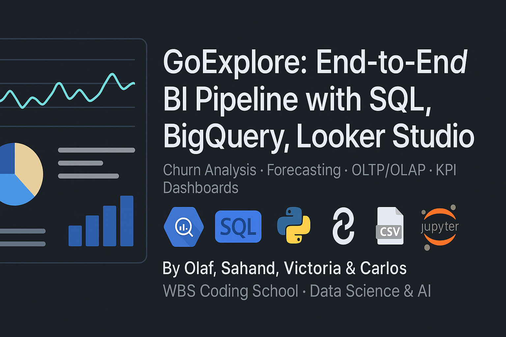

 

# kpi-datalake-oltp-olap-sql-bigquery-lookerstudio-endtoend-pipeline
End-to-end data science pipeline combining data engineering (CSV ingestion, data lake setup), SQL-based OLTP/OLAP modeling in BigQuery, customer analytics (churn, revenue loss), sales forecasting (time series modeling in Python), and interactive KPI dashboards in Looker Studio.

# 📊 GoExplore Data Analytics Project

Welcome to the GoExplore analytics pipeline! This project was created as part of the WBS Coding School's Data Science & AI course by **Olaf Bulas**, **Sahand Azizigargari**, **Victoria Vasilieva**, and **Carlos Montefusco**.

---
## 🧭 Project Overview

After GoExplore’s only data scientist suddenly left, the company was left with a single spreadsheet and no analytical infrastructure. Our challenge: **design and deliver a full data analytics system** — from raw data to interactive dashboards — to support business-critical decisions.

Our work includes:
- **Data ingestion**
- **Warehousing**
- **OLTP & OLAP modeling**
- **KPI tracking**
- **Forecasting**
- **Professional dashboarding**

---

## 🎯 Goals

- Ingest & clean data from CSV
- Explore and visualize initial metrics using Google Sheets
- Load data into BigQuery for scalable analytics
- Perform OLTP & OLAP querying for dashboards
- Build Looker Studio dashboards for executive reporting

---

## 📁 Repo Contents

| Folder              | Description |
|---------------------|-------------|
| `data/`             | Raw CSVs from GoExplore |
| `sql_queries/`      | SQL files used for insights and aggregation |
| `notebooks/`        | Jupyter notebook for sales prediction |
| `dashboards/`       | Looker Studio reports (PDF + HTML) |

---

## 🧰 Tools & Technologies

| Layer              | Stack / Tools                            |
|--------------------|-------------------------------------------|
| Data Lake          | CSV files                                 |
| Data Warehouse     | Google BigQuery (serverless SQL engine)   |
| ETL / Modeling     | SQL queries (OLTP & OLAP-style)           |
| BI & Dashboards    | Google Looker Studio                      |
| Forecasting        | Jupyter Notebook (Python, Pandas, Prophet)|
| Reporting Output   | HTML dashboards, PDF exports              |

---

## 📁 SQL Queries

Our SQL files power the analytical queries used in BigQuery, including:

| File | Description |
|------|-------------|
| `churn_rate_customers.sql` | Identifies monthly customer churn |
| `churn_rate_customers_revenue.sql` | Revenue loss from churned customers |
| `deep_diving_retailers.sql` | Sales breakdown by retailer & method |
| `monthly_sales_per_retailer.sql` | Monthly retailer performance overview |

---

## 📈 Forecasting

We applied time series forecasting techniques in the [`Sales_prediction.ipynb`](notebooks/Sales_prediction.ipynb) notebook using historical sales data to predict future demand. Key methods include:

- Data preprocessing with Pandas
- Trend modeling
- Forecasting using Facebook Prophet

---

## 🗂 Data Overview

### CSV Files
- `GoExplore_daily_sales.csv`: Raw daily sales data
- `GoExplore_methods.csv`: Sales channels/methods
- `GoExplore_products.csv`: Product catalog
- `GoExplore_retailers.csv`: Retailer metadata

---

## 🔍 Key Analyses

- **Churn Rate Analysis** (`churn_rate_customers.sql`)
- **Retailer Deep Dive** (`deep_diving_retailers.sql`)
- **Monthly Sales Performance** (`monthly_sales_per_retailer.sql`)
- **Customer Revenue Loss** (`churn_rate_customers_revenue.sql`)
- **Sales Prediction**: Time series modeling in `sales_prediction.ipynb`

---

## 📊 Dashboards

We built executive-ready dashboards in **Google Looker Studio**, linked to live BigQuery data.

### Included:
- 📄 [`LookerStudio_Business-kpi-dashboard.pdf`](dashboards/LookerStudio_Business-kpi-dashboard.pdf)
- 🌐 [`Looker Studio Revenue & Sales Dashboard (HTML)`](dashboards/Looker_Studio_Revenue_Sales_2025_07_02.html)

These dashboards present:
- Daily and monthly revenue trends
- Customer churn and retention
- Retailer performance breakdown
- Sales by product and method

---

## 👥 Team

This project was a collaborative effort by:

- Olaf Bulas
- Sahand Azizigargari
- Victoria Vasilieva
- Carlos Montefusco

---

## 🏷 Tags

`bigquery` · `lookerstudio` · `sql` · `oltp` · `olap` · `kpi` · `datalake` · `forecasting` · `dashboard` · `data-warehouse` · `end-to-end-project` · `business-intelligence`

